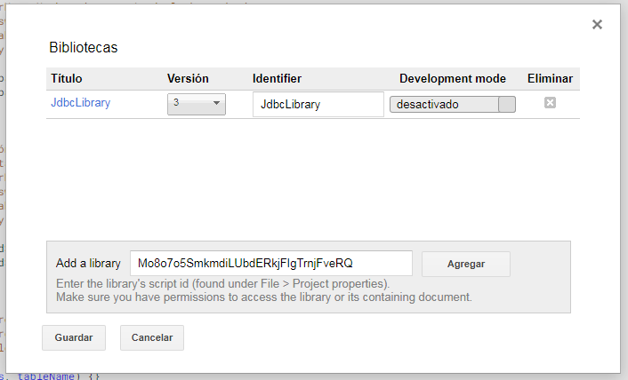

# Tabla de contenido
####

# JdbcLibrary
Librería desarrollada en Google Apps Script con funcionalidades útiles para desarrollos que utilicen bases de datos como MySQL, [Google Cloud SQL](https://cloud.google.com/sql/docs/?hl=es)

## Características
- Conectarse con bases de datos MySQL y Google Cloud SQL.
- Conjunto de métodos para operaciones CRUD (Create, Read, Update, Delete).
- Uso de sentencias preparadas (PreparedStatement).
- Permite ejecutar sentencias MySQL personalizadas.

# Primeros pasos
Primero se debe crear un proyecto en [Google Apps Script](https://script.google.com/home) ó abrir un proyecto previamente creado. posteriormente se debe acceder a la opción <b>Recursos > Bibliotecas</b>, y en el campo <b>Add a library</b> se ingresa el id de la librería `Mo8o7o5SmkmdiLUbdERkjFIgTrnjFveRQ` y se selecciona la versión mas actualizada, como se indica en la siguiente imagen.



Una vez incluida la librería `JdbcLibrary` se crea un archivo .gs y se inicializa una conexión con la base de datos.

```javascript
// Parámetros de conexión con la base de datos
var instanceName = "INSTANCE_NAME";
var userName = "DATABASE_USER";
var password = "DATABASE_PASSWORD";
var database = "DATABASE_NAME";

// Se establece una conexión con la base de datos
var connection = JdbcLibrary.connectToCloudSql(instanceName, userName, password, database);

// Se invoca la función que se desea ejecutar
connection.functionName();
```
> **NOTA**: El valor de cada uno de los parámetros de conexión con la base de datos se deben reemplazar por los respectivos valores.

# Funciones

| Función  | Descripción |
| - | - |
| [`connectToDatabase()`](#connecttodatabase) | Permite establecer una conexión con la base de datos. |
| [`connectToCloudSql()`](#connnecttocloudsql) | Permite consultar registros en la base de datos. |
| [`select()`](#markdown-header-insert) | Permite insertar un registro en la base de datos. |
| [`insert()`](#markdown-header-insert) | Permite insertar un registro en la base de datos. |
| [`insertBatch()`](#markdown-header-insertbatch) | Permite insertar múltiples registros en una misma tabla de la base de datos. |
| [`update()`](#markdown-header-update) | Permite actualizar los registros en la base de datos. |
| [`remove()`](#markdown-header-remove) | Permite eliminar registros en la base de datos. |
| [`replace()`](#markdown-header-remove) | Permite ejecutar la sentencia REPLACE sobre registros de una tabla de la base de datos. |
| [`replaceBatch()`](#markdown-header-remove) | Permite ejecutar la sentencia REPLACE sobre múltiples egistros de una tabla de la base de datos. |
| [`executeIntoTransaction()`](#markdown-header-executeintotransaction) | Permite ejecutar una o varias sentencias dentro de una transacción. |

## connectToDatabase()
Establece la conexión con una base de datos MySQL..
```javascript
// Parámetros de conexión con la base de datos
var url = "DATABASE_SERVER_URL";
var userName = "DATABASE_USER";
var password = "DATABASE_PASSWORD";
var database = "DATABASE_NAME";

// Se establece una conexión con la base de datos
var connection = JdbcLibrary.connectToDatabase(url, userName, password, database);
```

**Parámetros**
| Nombre  | Tipo | Descripción |
| - | - | - |
| url | `String` | Url de acceso a la base de datos. |
| userName | `String` | Nombre de usuario de la base de datos. Por ejemplo: `root`. |
| password | `String` | Contraseña del usuario de la base de datos. |
| database | `String` | Nombre de la base de datos. |

**Return**

**JdbcLibrary** - Instancia de la librería.

## connectToCloudSql()
Establece la conexión con una base de datos Cloud SQL.
```javascript
// Parámetros de conexión con la base de datos
var instanceName = "INSTANCE_NAME";
var userName = "DATABASE_USER";
var password = "DATABASE_PASSWORD";
var database = "DATABASE_NAME";

// Se establece una conexión con la base de datos
var connection = JdbcLibrary.connectToCloudSql(instanceName, userName, password, database);
```

**Parámetros**
| Nombre  | Tipo | Descripción |
| - | - | - |
| instanceName | `String` | Nombre de la instancia de Cloud SQL. |
| userName | `String` | Nombre de usuario de la base de datos. Por ejemplo: `root`. |
| password | `String` | Contraseña del usuario de la base de datos. |
| database | `String` | Nombre de la base de datos. |

**Return**

**JdbcLibrary** - Instancia de la librería.

## select()
Permite consultar registros en la base de datos.
```javascript
// Se inicializa la conexión
JdbcLibrary.connect({
  dbUrl: "jdbc:google:mysql://",
  instanceName: "INSTANCE_NAME",
  userName: "MY_USERNAME",
  password: "MY_PASSWORD",
  database: "DATABASE_NAME"
});

// Array donde se insertarán los registros retornados en la consulta
var records = [];

// SELECT * FROM users;
JdbcLibrary.select(records, "*", "users");

// SELECT * FROM users WHERE id = 1
connection.select(records, "*", "users", {
  recordType: "Object",
  queryCondition: "id = ?",
  values: ["1"]
});

// SELECT CONCAT(lastName, ', ', name) AS fullName, email FROM users WHERE name LIKE '%jose%' OR lastName LIKE '%jose%' ORDER BY lastName
connection.select(records, "CONCAT(lastName, ', ', name) AS fullName, email", "users", {
  recordType: "Object",
  queryCondition: "name LIKE ? OR lastName LIKE ?",
  values: ["%jose%", "%jose%"],
  additionalQuery: "ORDER BY lastName"
});

```
> Los registros retornados en la consulta se insertarán en el Array `records`

**Parámetros**

| Nombre  | Tipo | Descripción |
| - | - | - |
| recordsArray | `Array[Object] | Object` | Array u Objeto donde se insertarán los registros retornados en la ejecución de la consulta. |
| fieldsSelect | `String` | Campos a consultar en la base de datos. Por ejemplo: `*`, `name, lastName, email` |
| tableName | `String` | Nombre de la tabla donde se realizará la consulta. |
| additionalParams | `Object` | Parámetros adicionales en la consulta. |

**Propiedades del parámetro `additionalParams`**

```javascript
// Valores por defecto del parámetro additionalParams
{
  recordType: "Object",
  queryCondition: "",
  values: [],
  additionalQuery: "",
  loopFunction: function(recordsArray, recordItem) {
    recordsArray.push(recordItem);
  }
};
```

| Nombre  | Tipo | Descripción |
| - | - | - |
| recordType | `String` | Valor que indica si los registro de la consulta se retornan en forma de Objeto ("Object" por defecto) o en forma de Array ("Array"). |
| queryCondition | `String` | Texto de la condición a aplicar en la consulta. |
| values | `Array[*]` | Lista de valores a establecer en los comodines `?` de la condición definida en `queryCondition`. |
| additionalQuery | `String` | Texto con sentencias adicionales a incluir en la ejecución de la sentencia SELECT ("LIMIT", "GROUP BY", "ORDER BY"). |
| loopFunction | `Function` | Definición de la función que se ejecuta en cada iteración del recorrido de los resultados de la consulta. |

**Parámetros de la función `loopFunction`**

| Nombre  | Tipo | Descripción |
| - | - | - |
| recordsArray | `Array[Object] | Object` | Array u Objeto donde se insertarán los registros retornados en la ejecución de la consulta. |
| recordItem | `Array[*] | Object` | Array u Objeto con los datos del registro. |

## insert()
Permite insertar un registro en la base de datos.
```javascript
// Se establece la conexión con la base de datos.
var connection = JdbcLibrary.connect("INSTANCE_NAME", "MY_USERNAME", "MY_PASSWORD", "DATABASE_NAME");

// Se declara un array
var recordObject = {
  name: "Jhon",
  lastName: "Pearson",
  email: "jpearson@google.com"
};

// INSERT INTO users (name, lastName, email) VALUES ("Jhon", "Pearson", "jpearson@google.com");
connection.insert("users", recordObject);

// El Id único del registro insertado (si aplica) se asignará en la propiedad del objeto "recordObject.id"
```
> Los índices definidos en el objeto corresponde a los campos de la tabla donde se insertarán los respectivos datos.

**Parámetros**

| Nombre  | Tipo | Descripción |
| - | - | - |
| tableName | `String` | Nombre de la tabla donde se realizará la consulta. |
| recordObject | `Object` | Objeto con los datos del registro a insertar en la tabla. |

## insertBatch()
Permite insertar múltiples registros en una misma tabla de la base de datos.
```javascript
// Se establece la conexión con la base de datos.
var connection = JdbcLibrary.connect("INSTANCE_NAME", "MY_USERNAME", "MY_PASSWORD", "DATABASE_NAME");

// Se declara un array con los registros a insertar
var records = [
  {
    name: "Jhon",
    lastName: "Pearson",
    email: "jpearson@google.com",
    telephone: "3111111"
  },
  {
    name: "Jean",
    lastName: "Williams",
    email: "jwilliams@google.com",
    active: 1
  }
];

// Se declara un array con los campos a insertar en la tabla
var fields = ["name", "lastName", "email", "active", "telephone"];

// INSERT INTO users (name, lastName, email, active, telephone) VALUE
// ("Jhon", "Pearson", "jpearson@google.com", NULL, 3111111),
// ("Jean", "Williams", "jwilliams@google.com", 1, NULL);
connection.insertBatch("users", fields, records);

// El Id único de cada uno de los registros insertados (si aplica) se asignará en la propiedad "recordObject.id" del respectivo objeto 
```
> Si alguno de los campos definidos en `fields` no se definieron en alguno de los objetos a insertar, se establece `NULL` en el registro.

**Parámetros**

| Nombre  | Tipo | Descripción |
| - | - | - |
| tableName | `String` | Nombre de la tabla donde se realizará la consulta. |
| fieldsList | `Array[String]` | Array con el listado de campos a insertar en la base de datos. |
| recordsArray | `Array[Object]` | Lista de registros a insertar en la base de datos. |

## update()
Permite actualizar los registros en la base de datos.

```javascript
// Se establece la conexión con la base de datos.
var connection = JdbcLibrary.connect("INSTANCE_NAME", "MY_USERNAME", "MY_PASSWORD", "DATABASE_NAME");

// UPDATE users SET active = 1
connection.update("users", {
  active: 1
});

// Se declara un objeto con los datos del registro a actualizar
var recordObject = {
  name: "Jhon",
  lastName: "Pearson",
  email: "jpearson@google.com",
  telephone: "3222222"
};

// UPDATE users SET name = "Jhon", lastName = "Pearson", email = "jpearson@google.com", telephone = "3222222" WHERE id = 1
connection.update("users", recordObject, "id = ?", [1]);
```
**Parámetros**

| Nombre  | Tipo | Descripción |
| - | - | - |
| tableName | `String` | Nombre de la tabla donde se actualizará los registros. |
| recordValues | `Object` | Objeto con los datos a actualizar en la tabla. |
| condition | `String` | Texto de la condición a aplicar en la sentencia UPDATE. |
| values | `Array[*]` | Lista de valores a establecer en los comodines `?` de la condición definida en `condition`. |

## remove()
Permite eliminar registros en la base de datos.
```javascript
// Se establece la conexión con la base de datos.
var connection = JdbcLibrary.connect("INSTANCE_NAME", "MY_USERNAME", "MY_PASSWORD", "DATABASE_NAME");

// DELETE FROM users WHERE id = 1
connection.remove("users", "id = ?", [1]);
```
**Parámetros**

| Nombre  | Tipo | Descripción |
| - | - | - |
| tableName | `String` | Nombre de la tabla donde se actualizará los registros. |
| queryCondition | `String` | Texto de la condición a aplicar en la sentencia DELETE. |
| values | `Array[*]` | Lista de valores a establecer en los comodines `?` de la condición definida en `condition`. |

## executeIntoTransaction()
Permite ejecutar una o varias sentencias dentro de una Transacción.
```javascript
// Se establece la conexión con la base de datos.
var connection = JdbcLibrary.connect("INSTANCE_NAME", "MY_USERNAME", "MY_PASSWORD", "DATABASE_NAME");

// Se declaran dos objetos con los datos iniciales de dos usuarios y una variable con el valor a transferir
var user1, user2, transaction = 100;
// Se establece los valores de cada uno de los objetos
user1 = {
  id: 1,
  balance: 2000
};
user2 = {
  id: 2,
  balance: 1000
};

// Se establece el bloque de operaciones a ejecutar dentro de la transacción
connection.executeIntoTransaction(function(jdbcReference) {
  // UPDATE users SET balance = balance - 100 WHERE id = 1;
  jdbcReference.update("users", {balance: user1.balance - transaction}, "id = ?", [user1.id]);
  // UPDATE users SET balance = balance + 100 WHERE id = 2;
  jdbcReference.update("users", {balance: user2.balance + transaction}, "id = ?", [user2.id]);
});

// Si la transacción se ejecutó correctamente el resultado final debe quedar
user1 = {
  id: 1,
  balance: 1900
};
user2 = {
  id: 2,
  balance: 1100
};
```
**Parámetros**

| Nombre  | Tipo | Descripción |
| - | - | - |
| callbackExecute | `Function` | Función con las sentencias a ejecutar dentro de la transacción. |

# Sentencias personalizadas

JdbcLibrary cuenta con una alternativa que permite a los usuarios ejecutar sus propias sentencias en la base de datos. Para ello se debe emplear la propiedad `connectionInstance` de la variable que invoca la librería.

> Para este escenario se recomienda consultar la documentación del [Servicio Jdbc](https://developers.google.com/apps-script/reference/jdbc/) de Google Apps Script.

```javascript
var connection = JdbcLibrary.connect("INSTANCE_NAME", "MY_USERNAME", "MY_PASSWORD", "DATABASE_NAME");

// Se prepara la sentencia a ejecutar
var preparedStatement = connection.connectionInstance.preparedStatement("SELECT * FROM users WHERE id = ?");
// Se establece el valor del comodin del Id
preparedStatement.setInt(1, 1);

// Se ejecuta la sentencia
var resultSet = statement.executeQuery();
// Se recorre los registros retornados en la consulta
while (resultSet.next()) {
  // Acciones a ejecutar
}

```
