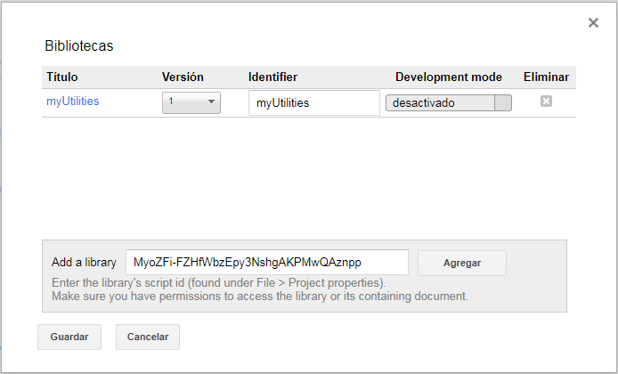

# MyUtilities
Conjunto de funcionalidades comunmente empleadas en el desarrollo de aplicaciones en Google Apps Script

# Primeros pasos
Primero se debe crear un proyecto en [Google Apps Script](https://script.google.com/home), ó abrir un proyecto previamente creado. Posteriormente se debe acceder a la opción <b>Recursos > Bibliotecas</b>, y en el campo <b>Add a library</b> se ingresa el id de la librería `MyoZFi-FZHfWbzEpy3NshgAKPMwQAznpp` y se selecciona la versión mas reciente.



Adicionalmente, se cuenta con un conjunto de funcionalidades realizadas en JavaScript; las cuales podrán utilizarse en las aplicaciones web. Para ello, se debe copiar la siguiente linea dentro de las etiquetas `<head>` de nuestra aplicación.
```html
<script src="https://sinovasas.github.io/myUtilities.js"></script>
```

# Lista de funciones
A continuación, se encuentra el listado de cada una de las funciones que conforman la librería.

| Función  | Disponible en GAS | Disponible en JavaScript | Descripción |
| - | - | - | - |
| [`allowOnlyNumber()`](#allowonlynumber) | |  | Permite configurar un campo de tipo `<INPUT>` para que solamente permita ingresar caracteres numéricos (0-9). |
| [`combineObject()`](#combineobject) |  |  | Establece las propiedades de una variable de tipo Object sobre otra variable del mismo tipo. |
| [`exponentialBackoff()`](#exponentialbackoff) |  | | Aplica el algoritmo de retroceso exponencial para obtener algún recurso de las API de Google Apps Script. |
| [`getCapitalizeText()`](#getcapitalizetext) |  |  | Convierte un texto a notación Camel Case (primer caracter de cada palabra en mayúscula). |
| [`getCardinal()`](#getcardinal) |  |  | Obtiene el valor cardinal de un número. |
| [`getCloudSQLConnection()`](#getcloudsqlconnection) |  | | Establece una conexión con una instancia de base de datos en Google Cloud SQL. |
| [`getColumnLetter()`](#getcolumnletter) |  |  | Convierte el número de la posición de la columna de una hoja de cálculo a su correspondiente letra. |
| [`getColumnNumber()`](#getcolumnnumber) |  |  | Convierte la letra asociada a la columna de una hoja de cálculo a su correspondiente número. |
| [`getFormattedText()`](#getformattedtext) |  |  | Obtiene un texto formateado para comparación o búsqueda. |
| [`getHolidayDates()`](#getholidaydates) |  |  | Obtiene los días festivos de un determinado año en el calendario de Colombia. |
| [`getHtmlContent()`](#gethtmlcontent) |  | | Obtiene el contenido de un archivo `.html` asociado un proyecto Google Apps Script. |
| [`getKeyValue()`](#getkeyvalue) |  | | Encripta o desencripta un texto definido por parámetro. Esta función puede emplearse por ejemplo, para parámetros GET en la URL de una aplicación web. |
| [`getMySQLConnection()`](#getmysqlconnection) |  | | Establece una conexión con una base de datos MySQL. |
| [`insertGetParams()`](#insertgetparams) |  |  | Inserta los parámetros definidos en un objeto como parámetros GET en una URL. |
| [`isValidEmail()`](#isvalidemail) |  |  | Valida si el texto definido por parámetro corresponde a una dirección de correo electrónico. |
| [`numberToRoman()`](#numbertoroman) |  |  | Convierte un número entero positivo a su valor equivalente en el sistema de numeración romano. |
| [`setSelectValues()`](#setselectvalues) | |  | Establece las opciones a seleccionar en un campo de tipo `<SELECT>`. |
| [`replaceLatinSymbols()`](#replacelatinsymbols) |  |  | Reemplaza los acentos y caracteres latinos por las respectivas vocales. |
| [`romanToNumber()`](#romantonumber) |  |  | Convierte un número romano a su valor equivalente en el sistema de numeración decimal. |
| [`validateFormField()`](#validateformfield) | |  | Permite validar cada uno de los campos del formulario, y consolidar su valor en una variable de tipo `Object`. |

> GAS: Google Apps Script

## allowOnlyNumber()
Permite configurar un campo de tipo `<INPUT>` para que solamente permita ingresar caracteres numéricos (0-9)
```html
<input type="text" id="txtNumber">
```
```javascript
// Referencia al campo del formulario
var txtNumber = document.getElementById("txtNumber");
// Ejemplo de uso de la función.
myUtilities.allowOnlyNumber(txtNumber);
```
**Parámetros**

| Nombre  | Tipo | Descripción |
| - | - | - |
| field | `HTMLInputElement` | Referencia al campo de texto sobre el cual se establece la configuración. |

## combineObject()
Establece las propiedades de una variable de tipo Object sobre otra variable del mismo tipo.
```javascript
// Objetos de datos
var object1 = {name: "Pedro"};
var object2 = {name: "Pablo", age: 22};

myUtilities.combineObject(object1, object2); // Ó myUtilities.combineObject(object1, object2, true, true)
// Resultado: object1 = {name: "Pablo", age: 22}

myUtilities.combineObject(object1, object2, true, false);
// Resultado: object1 = {name: "Pablo"}

myUtilities.combineObject(object1, object2, false, true);
// Resultado: object1 = {name: "Pedro", age: 22}

// Esta opción no realiza cambio alguno en el objeto del primer parámetro
myUtilities.combineObject(object1, object2, false, false);
```

**Parámetros**

| Nombre  | Tipo | Descripción |
| - | - | - |
| obj | `Object` | Objeto sobre el cual se actualizará las propiedades. |
| src | `Object` | Objeto del cual se obtienen los valores a establecer en `obj`. |
| updateValues | `Boolean` | Valor de verdad que indica si se actualiza o no los los valores definidos en el objeto `src` que existen en el objeto `obj`.<br>Valor por defecto: `true`. |
| updateIndex | `Boolean` | Valor de verdad que indica si se establece o no los atributos de objeto `src` que no existen en el objeto `obj`.<br>Valor por defecto: `true`. |

## exponentialBackoff()
Aplica el algoritmo de retroceso exponencial para obtener algún recurso de las API de Google Apps Script.
```javascript
// Id de un archivo de hoja de cálculo
var spreadsheetId = "ID_HOJA_CALCULO";
// Ejemplo de uso de la función
var spreadsheet = myUtilities.exponentialBackoff(function() {
  return SpreadsheetApp.openById(spreadsheetId);
});
```

**Parámetros**

| Nombre  | Tipo | Descripción |
| - | - | - |
| callbackFunction | `Function` | Función sobre la cual se desea aplicar el retroceso exponencial. |
| intents | `Number` | Número de intentos para ejecutar la función `callbackFunction`.<br>Valor por defecto: `5`. |

**Return**

**any** - Valor que retorne la función `callbackFunction` definida por parámetro.

## getCapitalizeText()
Convierte un texto a notación Camel Case (primer caracter de cada palabra en mayúscula).
```javascript
// Nombre de una persona
var name = "jorge abelardo pacheco";
// Ejemplo de uso de la función
name = myUtilities.getCapitalizeText(name);
// Salida: "Jorge Abelardo Pacheco"
```

**Parámetros**

| Nombre  | Tipo | Descripción |
| - | - | - |
| text | `String` | Texto del cual se desea aplicar la notación. |

**Return**

**String** - Texto en notación Camel Case.

## getCardinal()
Obtiene el valor cardinal de un número.
```javascript
// Valor a convertir
var number = 1200000;
// Ejemplo de uso de la función
var cardinalNumber = myUtilities.getCardinal(number);
// Resultado: "UN MILLÓN DOSCIENTOS MIL"
```

**Parámetros**

| Nombre  | Tipo | Descripción |
| - | - | - |
| value | `Number` | Número que se desea convertir a valor cardinal. |

**Return**

**Object** - Objeto con las partes del valor cardinal del número definido por parámetro.
| Nombre  | Tipo | Descripción |
| - | - | - |
| value | `String` | Valor cardinal de la parte entera del número (antes del punto). |
| decimal | `String` | Valor cardinal de la parte decimal del número (después del punto). |
| decimalUnits | `Number` | Número de dígitos que contiene la parte decimal del número. |
| decimalUnitsText | `String` | Unidad asociada a la parte decimal (`Décimas`, `Centésimas`, `Milésimas`, etc.). |

## getCloudSQLConnection()
Establece una conexión con una instancia de base de datos en Google Cloud SQL.
```javascript
// Valores requeridos para conectar la aplicación a una instancia de base de datos en Google Cloud SQL.
var instanceName = "CLOUD_SQL_INSTANCE_NAME";
var userName = "DATABASE_USERNAME";
var password = "DATABASE_USERPASSWORD";
var database = "DATABASE_NAME";

// Ejemplo de uso de la función
var connection = myUtilities.getCloudSQLConnection(instanceName, userName, password, database);
```
> Por medio de la variable `connection` se invoca cada una de las funciones definidas en la sección [`JdbcInstance`](#jdbcinstance).

**Parámetros**

| Nombre  | Tipo | Descripción |
| - | - | - |
| instanceName | `String` | Nombre de la instancia de Cloud SQL. |
| userName | `String` | Nombre de usuario de la base de datos. |
| password | `String` | Contraseña del usuario de la base de datos. |
| database | `String` | Nombre de la base de datos. |

**Return**

**JdbcInstance** - Instancia a las funciones que se pueden ejecutar sobre una conexión a la base de datos. Para más información, consultar la sección [`JdbcInstance`](#jdbcinstance).

## getColumnLetter()
Convierte el número de la posición de la columna de una hoja de cálculo a su correspondiente letra.
```javascript
// Número de columna
var columnNumber = 22;
// Ejemplo de uso de la función
var columnLetter = myUtilities.getColumnLetter(columnNumber);
// Salida: "V"
```

**Parámetros**

| Nombre  | Tipo | Descripción |
| - | - | - |
| columnNumber | `Number` | Número de columna de la hoja de cálculo. |

**Return**

**String** - Posición en la columna en notación A1 (letra del alfabeto).

## getColumnNumber()
Convierte la letra asociada a la columna de una hoja de cálculo a su correspondiente número.
```javascript
// Letra asociada a la columna de la Hoja de cálculo
var columnLetter = "AB";
// Ejemplo de uso de la función
var columnNumber = myUtilities.getColumnNumber(columnLetter);
// Salida: 28
```

**Parámetros**

| Nombre  | Tipo | Descripción |
| - | - | - |
| columnLetter | `String` | Letra asociada a la columna de la hoja de cálculo. |

**Return**

**Number** - Posición de la columna.

## getFormattedText()
Obtiene un texto formateado para comparación o búsqueda.
```javascript
// Valor a formatear
var text = "  Google Apps Script  ";
// Ejemplo de uso de la función
text = myUtilities.getFormattedText(text);
// Salida: "google apps script"
```

**Parámetros**

| Nombre  | Tipo | Descripción |
| - | - | - |
| textValue | `String` | Texto que se desea formatear. |
| transformFunctionName | `String` | Nombre de la función que indica si el texto se convierte a minúscula (`toLowerCase`) o mayúscula (`toUpperCase`).<br>Valor por defecto: `toLowerCase`. |
| replaceVowels | `Boolean` | Valor de verdad que indica si se reemplaza valores acentuados por las equivalentes vocales.<br>Valor por defecto: `true`. |

**Return**

**String** - Texto formateado, de acuerdo a los parámetros indicados.

## getHolidayDates()
Obtiene los días festivos de un determinado año en el calendario de Colombia.
```javascript
// Año que se desea consultar
var year = 2019;
// Ejemplo de uso de la función
var holidays = myUtilities.getHolidayDates(year);

/*
Resultado:
{
  "0": [1, 7], Enero: Año nuevo (1), Día de los reyes magos (7)
  "2": [25], Marzo: Día de San José (25)
  "3": [21, 14, 18, 19], Abril: Domingo de Ramos (14), Jueves Santo (18), Viernes Santo (19), Domingo de resurrección (21)
  "4": [1], Mayo: Día del Trabajo (1)
  "5": [3, 24], Junio: Día de la Ascención (3), Corpus Christi (24)
  "6": [20, 1], Julio: Sagrado Corazón (1), San Pedro y San Pablo(1), Día de la Independencia (20)
  "7": [7, 19], Agosto: Batalla de Boyacá (7), La asunción de la Virgen (19)
  "9": [14], Octubre: Día de la Raza (14)
  "10": [4, 11], Noviembre: Día de Todos los Santos (4), Independencia de Cartagena (11)
  "11": [8, 25], Diciembre: Día de la Inmaculada Concepción (8), Día de Navidad (25)
}
*/
```

## getHtmlContent()
Obtiene el contenido de un archivo `.html` asociado un proyecto Google Apps Script.
```javascript
// Referencia a archivos HTML de un proyecto Google Apps Script
var htmlEmail = HtmlService.createHtmlOutputFromFile("Email");
var htmlFunctions = HtmlService.createHtmlOutputFromFile("Functions");
var htmlTemplate = HtmlService.createTemplateFromFile("Index");

// Ejemplo de uso de la función con cada una de las opciones
var htmlEmailContent = myUtilities.getHtmlContent(htmlEmail);
var htmlFunctionsContent = myUtilities.getHtmlContent(htmlFunctions, true);
var htmlTemplateContent = myUtilities.getHtmlContent(htmlEmail, false, {title: "myApp"});
```

**Parámetros**

| Nombre  | Tipo | Descripción |
| - | - | - |
| templateFile | `HtmlTemplate|HtmlOutput` | Referencia al archivo HTML del cual se desea obtener el contenido. |
| isJsCode | `Boolean` | Valor de verdad que indica si el contenido del archivo `templateFile` corresponde a código JavaScript a incluir en el proyecto. |
| params | `Object` | Objeto con atributos a definir en los `Scriptlets` del archivo `templateFile` (solo si es de tipo `HtmlTemplate`). |

**Return**

**String** - Contenido HTML del archivo `templateFile`.

## getKeyValue()
Encripta o desencripta un texto definido por parámetro. Esta función puede emplearse por ejemplo, para parámetros GET en la URL de una aplicación web.
```javascript
// Valor de ejemplo
var parameter = "123abc";

// Valor encriptado
var encryptedValue = myUtilities.getKeyValue(parameter, true);

// Valor desencriptado (Resultado: el valor original)
var desencryptedValue = myUtilities.getKeyValue(encryptedValue, false);
```

**Parámetros**

| Nombre  | Tipo | Descripción |
| - | - | - |
| value | `String` | Valor a encriptar y desencriptar. |
| encrypt | `Boolean` | Valor de verdad que indica si se encripta (`true`) o desencripta (`false`) el valor definido en el parámetro `value`. |

**Return**

**String** - Valor encriptado o desencriptado del parámetro `value`.

## getMySQLConnection()
Establece una conexión con una base de datos MySQL.
```javascript
// Valores requeridos para conectar la aplicación a una instancia de base de datos en Google Cloud SQL.
var url = "DATABASE_URL";
var userName = "DATABASE_USERNAME";
var password = "DATABASE_USERPASSWORD";
var database = "DATABASE_NAME";

// Ejemplo de uso de la función
var connection = myUtilities.getMySQLConnection(url, userName, password, database);
```
> Por medio de la variable `connection` se invoca cada una de las funciones definidas en la sección [`JdbcInstance`](#jdbcinstance).

**Parámetros**

| Nombre  | Tipo | Descripción |
| - | - | - |
| url | `String` | URL del servidor donde se encuentra la base de daros. |
| userName | `String` | Nombre de usuario de la base de datos. |
| password | `String` | Contraseña del usuario de la base de datos. |
| database | `String` | Nombre de la base de datos. |

**Return**

**JdbcInstance** - Instancia a las funciones que se pueden ejecutar sobre una conexión a la base de datos. Para más información, consultar la sección [`JdbcInstance`](#jdbcinstance).

## insertGetParams()
Inserta los parámetros definidos en un objeto como parámetros GET en una URL.
```javascript
// URL a la cual se establecen los parámetros GET
var url = "www.sinova.co";
// Objeto con los parámetros a establecer
var parameters = {
  id: "1",
  name: "jorge",
  email: "usuario@correo.com"
};

// Ejemplo de uso de la función
url = myUtilities.insertGetParams(url, parameters);
// Salida: "www.sinova.co?id=1&name=jorge&email=usuario@correo.com"
```

**Parámetros**

| Nombre  | Tipo | Descripción |
| - | - | - |
| URL | `String` | URL a la cual se insertarán los parámetros GET. |
| parameters | `Object` | Objeto de datos con los parámetros a establecer en la URL. |

**Return**

**String** - URL con los parámetros GET establecidos.

## isValidEmail()
Valida si el texto definido por parámetro corresponde a una dirección de correo electrónico.
```javascript
// Variables con el nombre y correo de una persona
var name = "José Ernesto Padilla";
var email = "micorreo@empresa.com.co"

// Ejemplos de uso de la función
var validate1 = myUtilities.isValidEmail(name); // Resultado: FALSE
var validate2 = myUtilities.isValidEmail(email); // Resultado: TRUE
```

**Parámetros**

| Nombre  | Tipo | Descripción |
| - | - | - |
| email | `String` | Texto que se desea validar. |

**Return**

**Boolean** - Valor de verdad que indica si el valor del parámetro `email` corresponde o no a una dirección de correo electrónico (`true` o `false`, respectivamente).

## numberToRoman()
Convierte un número entero positivo a su valor equivalente en el sistema de numeración romano.
```javascript
// Número a convertir
var number = 19;
// Ejemplo de uso de la función
var romanNumber = myUtilities.numberToRoman(number);
// Resultado: "XIX"
```

**Parámetros**

| Nombre  | Tipo | Descripción |
| - | - | - |
| number | `Number` | Número entero a convertir. |

**Return**

**String** - Valor convertido al sistema de numeración romano.

## setSelectValues()
Establece las opciones a seleccionar en un campo de tipo `<SELECT>`.
```html
<select id="selectCountries"></select>
```
```javascript
// Referencia al campo del formulario
var selectCountries = document.getElementById('selectCountries');
// Lista de paises
var countries = ["ARG", "BRA", "COL", "URU", "VEN", "ECU", "BOL", "CHI", "PER", "PAR"];

// Ejemplo de uso de la función
myUtilities.setSelectValues(selectCountries, countries);
// El mismo ejemplo, indicando todos los posibles parámetros
myUtilities.setSelectValues(selectCountries, countries {
  toEmpty: true,
  emptyOption: true,
  emptyOptionText: "- selecciona -",
  callbackInsertOption: function(select, index, value) {
    var option = document.createElement("option");
    option.value = value;
    option.text = value;
    select.add(option);
  }
});
```
```html
<select id="selectCountries">
  <option>"- selecciona -</option>
  <option value="ARG">ARG<option>
  <option value="BRA">BRA<option>
  <option value="COL">COL<option>
  <option value="URU">URU<option>
  <option value="VEN">VEN<option>
  <option value="ECU">ECU<option>
  <option value="BOL">BOL<option>
  <option value="CHI">CHI<option>
  <option value="PER">PER<option>
  <option value="PAR">PAR<option>
</select>
```
**Parámetros**

| Nombre  | Tipo | Descripción |
| - | - | - |
| select | `HTMLInputElement` | Referencia al campo de lista desplegable `<SELECT>`  sobre el cual se establece las opciones a elegir. |
| values | `Array` | Lista de opciones a incluir en el campo `select`. |
| params | `Object` | Objeto con opciones adicionales a definir en el campo. |

**Propiedades del parámetro `params`**
| Nombre  | Tipo | Descripción |
| - | - | - |
| toEmpty | `Boolean` | Valor que indica si se elimina el contenido del campo `select`.<br>Valor por defecto: `true`. |
| emptyOption | `Boolean` | Valor que indica si se inserta una opción vacía en el campo `select`.<br>Valor por defecto: `true`. |
| emptyOptionText | `String` | Valor que indica si se inserta una opción vacía en el campo `select`.<br>Valor por defecto: `- selecciona -`. |
| callbackInsertOption | `Function` | Función que se ejecuta al insertar cada una de las opciones en el campo `select`. |

**Parámetros de la función `callbackInsertOption`**
| Nombre  | Tipo | Descripción |
| - | - | - |
| select | `HTMLInputElement` | Referencia al campo definido en el parámetro `select` de la función principal. |
| index | `*` | Índice del elemento de la lista. |
| value | `*` | Valor correspondiente a cada uno de los elementos de la lista `values`. |

> *: El tipo de dato puede variar.

## replaceLatinSymbols()
Reemplaza los acentos y caracteres latinos por las respectivas vocales.
```javascript
// Nombre que contiene acentos
var nombre = "Fabián González Muñoz";
// Se invoca la función
nombre = myUtilities.replaceLatinSymbols(nombre);
// Salida: Fabian Gonzalez Muñoz
```

**Parámetros**

| Nombre  | Tipo | Descripción |
| - | - | - |
| text | `String` | Texto del cual se desea reemplazar los acentos. |

**Return**

**String** - Texto con los acentos reemplazados.

## romanToNumber()
Convierte un número romano a su valor equivalente en el sistema de numeración decimal.
```javascript
// Número a convertir
var romanNumber = "XXI";
// Ejemplo de uso de la función
var number = myUtilities.romanToNumber(romanNumber);
// Resultado: 21
```

**Parámetros**

| Nombre  | Tipo | Descripción |
| - | - | - |
| romanNumber | `String` | Número romano a convertir. |

**Return**

**String** - Valor convertido al sistema de numeración decimal.

## validateFormField()
Permite validar cada uno de los campos de un formulario HTML, y consolidar su valor en una variable de tipo `Object`.
```HTML
<form id="formContact">
  <label>Nombre</label><br>
  <input type="text" name="txtName" required><br>
  <label>Correo electrónico</label><br>
  <input type="email" name="txtEmail" required><br>
  <label>Cuenta de correo</label><br>
  <select name="selectAccountType" required>
    <option value="">- seleccione -</option>
    <option value="G Suite">G Suite</option>
    <option value="Microsoft 365">Microsoft 365</option>
    <option value="Otro">Otro</option>
    <option value="Ninguno">Ninguno</option>
  </select><br>
  <label>Descripción</label><br>
  <textarea name="txtDescription"></textarea><br>
  <button type="submit">Enviar</button><br>
</form>
```
```javascript
// Se referencia el formulario
var formContact = document.getElementById("formContact");
// Se establece el evento SUBMIT del formulario
formContact.onsubmit = function(e) {
  // Se omite la ejecución por defecto del evento
  e.preventDefault();

  // Objeto donde se consolida la información
  var contactObject = {};
  // Se invoca la función para cada uno de los campos del formulario
  validateFormField(e.target, "txtName", contactObject, "name");
  validateFormField(e.target, "txtEmail", contactObject, "email", {
    // Valor por defecto
    defaultValue: "",
    // Campo requerido
    required: true,
    // Mensaje de error a mostrar si el campo no tiene un valor establecido
    requiredText: ("Por favor ingrese una dirección de correo electrónico válida"),
    // Función que establece el valor del campo de formulario en el objeto de datos
    callbackSetValue: function (objectForm, attrName, fieldValue) {
      objectForm[attrName] = fieldValue || this.defaultValue;
    },
    // Función a ejecutar si no existe el campo en el formulario
    callbackNotFieldFunction: function (fieldName) {
      throw "Por favor valide el campo \"" + fieldName + "\"";
    }
  });
  validateFormField(e.target, "selectAccountType", contactObject, "accountType");
  validateFormField(e.target, "txtDescription", contactObject, "description", {
    required: false
  });

  // Acciones a realizar...
};
```


# JdbcInstance
Conjunto de funciones que se pueden emplear para registrar y consultar información sobre bases de datos MySQL.

| Función  | Descripción |
| - | - |
| [`select()`](#select) | Consulta los registros de la base de datos. |
| [`insert()`](#insert) | Inserta un registro en la base de datos. |
| [`insertBatch()`](#insertbatch) | Inserta múltiples registros en la base de datos. |
| [`update()`](#update) | Actualiza la información de los registros de la base de datos. |
| [`remove()`](#remove) | Elimina los registros de la base de datos. |
| [`replace()`](#replace) | Reemplaza los datos de un registro cuyo identificador único se encuentra definido en el objeto de datos. |
| [`replaceBatch()`](#replacebatch) | Ejecuta la sentencia `REPLACE` sobre varios registros. |

## select()
Consulta los registros de la base de datos.
```javascript
// Conexión con la base de datos
var connection = myUtilities.getCloudSQLConnection("CLOUD_SQL_INSTANCE_NAME", "DATABASE_USERNAME", "DATABASE_USERPASSWORD", "DATABASE_NAME");

// Variable donde se consolidarán los registros retornados en la consulta
var records = [];

// Equivale a: SELECT * FROM clients
connection.select(records, "clients");

// Dicha función equivale a escribir
connection.select(records, "clients", "*", {
  recordType: "Object", // ó "Array"
  queryCondition: "",
  values: [],
  additionalQuery: "",
  loopFunction: function(recordsList, recordItem) {
    recordsList.push(recordItem);
  }
});

// Equivale a: SELECT id, name, country FROM clients WHERE country = 'Colombia' LIMIT 0, 10
connection.select(records, "clients", "id, name, country", {
  recordType: "Object",
  queryCondition: "country = ?",
  values: ['Colombia'],
  additionalQuery: "LIMIT 0, 10",
  loopFunction: function(recordsList, recordItem) {
    recordsList.push(recordItem);
  }
});
```

**Parámetros**

| Nombre  | Tipo | Descripción |
| - | - | - |
| records | `Array` | Lista donde se insertarán cada uno de los registros retornados en la consulta. |
| tableName | `String` | Nombre de la tabla sobre la cual se realizará la consulta. |
| fieldsSelect | `String` | Definición de los campos que se desean consultar.<br>Valor por defecto: `*` |
| additionalParams | `Object` | Objeto con parámetros adicionales en la consulta. |

**Propiedades del parámetro `additionalParams`**
| Nombre  | Tipo | Descripción |
| - | - | - |
| recordType | `String` | Tipo de dato en que se establece cada uno de los registros de la consulta (`Array` u `Object`). |
| queryCondition | `String` | Condición a incluir en la consulta. Para indicar cada uno de los valores a incluir en la consulta se debe incluir el comodín `?`.<br>Ejemplo: `year = ? AND country = ?` |
| values | `Array` | Array con cada uno de los valores a establecer en cada uno de los comodines definidos (en su respectivo orden) en el parámetro `queryCondition`. |
| additionalQuery | `String` | Texto adicional a incluir en la consulta. Por ejemplo, para definir sentencias como `LIMIT`, `GROUP BY`, `HAVING`. |
| loopFunction | `Function` | Función que se ejecuta en el recorrido de cada uno de los registros de la consulta. |

**Parámetros de la función `loopFunction`**
| Nombre  | Tipo | Descripción |
| - | - | - |
| recordsList | `Array` | Valor definido en el parámetro `records` de la función `select`. |
| recordItem | `Object` | Objeto con los datos de cada uno de los registros de la consulta. |

## insert()
Inserta un registro en la base de datos.
```javascript
// Conexión con la base de datos
var connection = myUtilities.getCloudSQLConnection("CLOUD_SQL_INSTANCE_NAME", "DATABASE_USERNAME", "DATABASE_USERPASSWORD", "DATABASE_NAME");

// Variable con los datos a insertar en la tabla
var recordObject = {
  name: "Jhon",
  surname: "McFly",
  email: "jhon.mcfly@mydomain.com"
};

// Equivale a: INSERT INTO clients (name, surname, email) VALUES ('Jhon', 'McFly', 'jhon.mcfly@mydomain.com');
connection.insert("clients", recordObject);
// Se establece en el objeto "recordObject" el atributo correspondiente al Id único del registro.
// recordObject = {id: 1, name: "Jhon", surname: "McFly", email: "jhon.mcfly@mydomain.com"};
```
> Si el registro fue insertado correctamente, se establece en el objeto `recordObject` la propiedad correspondiente al identificador único (*Primary Key: PK*) del registro insertado.

**Parámetros**

| Nombre  | Tipo | Descripción |
| - | - | - |
| tableName | `String` | Nombre de la tabla sobre la cual se insertará el registro. |
| recordObject | `Object` | Objeto de datos del registro a insertar.<br>**NOTA**: es importante que el nombre de los atributos del objeto correspondan al nombre de las columnas de la tabla para que el procedimiento se ejecute satisfactoriamente. |
| primaryKey | `String` | Nombre de la columna *Primary Key* de la tabla.<br>Valor por defecto: `id` |

## insertBatch()
Inserta múltiples registros en la base de datos.
```javascript
// Conexión con la base de datos
var connection = myUtilities.getCloudSQLConnection("CLOUD_SQL_INSTANCE_NAME", "DATABASE_USERNAME", "DATABASE_USERPASSWORD", "DATABASE_NAME");

// Variable con los datos a insertar en la tabla
var studentsList = [
  {name: "Julie", surname: "Thompson"},
  {name: "Peter", surname: "Watson"},
  {name: "Sara", surname: "Rogers"}
];

// Equivale a: INSERT INTO students (name, surname) VALUES ('Julie', 'Thompson'), ('Peter', 'Watson'), ('Sara', 'Rogers');
connection.insertBatch("students", ['name', 'surname'], studentsList);
// Se establece en cada uno de los ítems de la lista, el atributo correspondiente al Id único del registro.
// studentsList = [{id: 1, name: "Julie", surname: "Thompson"}, {id: 2, name: "Peter", surname: "Watson"}, {id: 3, name: "Sara", surname: "Rogers"}];
```

**Parámetros**

| Nombre  | Tipo | Descripción |
| - | - | - |
| tableName | `String` | Nombre de la tabla sobre la cual se insertará el registro. |
| fieldsList | `Array` | Lista con el nombre de cada uno de los campos sobre el cual se establecerá la sentencia `INSERT`. |
| recordsArray | `Array[Object]` | Lista de registros a insertar en la tabla indicada. |
| primaryKey | `String` | Nombre de la columna *Primary Key* de la tabla.<br>Valor por defecto: `id` |

## update()
Actualiza la información de los registros de la base de datos.
```javascript
// Conexión con la base de datos
var connection = myUtilities.getCloudSQLConnection("CLOUD_SQL_INSTANCE_NAME", "DATABASE_USERNAME", "DATABASE_USERPASSWORD", "DATABASE_NAME");

// Variable con los datos a insertar en la tabla
var recordObject = {
  state: 'Activo'
};

// Equivale a: UPDATE students SET state = 'Activo'
connection.update("students", recordObject);

// Equivale a: UPDATE students SET state = 'Activo' WHERE id IN (1, 2, 3)
connection.update("students", recordObject, "id IN (?, ?, ?)", [1, 2, 3]);
```

**Parámetros**

| Nombre  | Tipo | Descripción |
| - | - | - |
| tableName | `String` | Nombre de la tabla sobre la cual se ejecutará la sentencia `UPDATE`. |
| recordObject | `Object` | Objeto de datos a actualizar en la tabla.<br>**NOTA**: es importante que el nombre de los atributos del objeto correspondan al nombre de las columnas de la tabla para que el procedimiento se ejecute satisfactoriamente. |
| condition | `String` | Condición a establecer en la sentencia `UPDATE`. Para indicar cada uno de los valores a incluir en la consulta se debe incluir el comodín `?`.<br>Ejemplo: `year = ? AND country = ?` |
| values | `Array` | Array con cada uno de los valores a establecer en cada uno de los comodines definidos (en su respectivo orden) en el parámetro `condition`. |

## remove()
Elimina los registros de la base de datos.
```javascript
// Conexión con la base de datos
var connection = myUtilities.getCloudSQLConnection("CLOUD_SQL_INSTANCE_NAME", "DATABASE_USERNAME", "DATABASE_USERPASSWORD", "DATABASE_NAME");

// Equivale a: DELETE FROM students
connection.remove("students");

// Equivale a: DELETE FROM students WHERE id IN (1, 2, 3)
connection.remove("students", "id IN (?, ?, ?)", [1, 2, 3]);
```

**Parámetros**

| Nombre  | Tipo | Descripción |
| - | - | - |
| tableName | `String` | Nombre de la tabla sobre la cual se ejecutará la sentencia `DELETE`. |
| condition | `String` | Condición a establecer en la sentencia `DELETE`. Para indicar cada uno de los valores a incluir en la consulta se debe incluir el comodín `?`.<br>Ejemplo: `year = ? AND country = ?` |
| values | `Array` | Array con cada uno de los valores a establecer en cada uno de los comodines definidos (en su respectivo orden) en el parámetro `condition`. |

## replace()
Reemplaza los datos de un registro cuyo identificador único se encuentra definido en el objeto de datos.
```javascript
// Conexión con la base de datos
var connection = myUtilities.getCloudSQLConnection("CLOUD_SQL_INSTANCE_NAME", "DATABASE_USERNAME", "DATABASE_USERPASSWORD", "DATABASE_NAME");

// Variable con los datos a reemplazar en la tabla
var recordObject = {
  id: 10,
  name: "Jhon",
  surname: "McFly",
  email: "jhon.mcfly@mydomain.com"
};

// Equivale a: REPLACE INTO clientes (id, name, surname, email) VALUES (10, 'Jhon', 'McFly', 'jhon.mcfly@mydomain.com')
myUtilities.replace("clients", recordObject);
// Esto reemplazará los datos del registro cuyo Id es igual a '10'
```

**Parámetros**

| Nombre  | Tipo | Descripción |
| - | - | - |
| tableName | `String` | Nombre de la tabla sobre la cual se insertará el registro. |
| recordObject | `Object` | Objeto de datos del registro a insertar.<br>**NOTA**: es importante que el nombre de los atributos del objeto correspondan al nombre de las columnas de la tabla para que el procedimiento se ejecute satisfactoriamente. |

## replaceBatch()
Ejecuta la sentencia `REPLACE` sobre varios registros.
```javascript
// Conexión con la base de datos
var connection = myUtilities.getCloudSQLConnection("CLOUD_SQL_INSTANCE_NAME", "DATABASE_USERNAME", "DATABASE_USERPASSWORD", "DATABASE_NAME");

// Variable con los datos a insertar en la tabla
var studentsList = [
  {id: 1, name: "Julie", surname: "Thompson"},
  {id: 2, name: "Peter", surname: "Watson"},
  {id: 3, name: "Sara", surname: "Rogers"}
];

// Equivale a: REPLACE INTO students (id, name, surname) VALUES (1, 'Julie', 'Thompson'), (2, 'Peter', 'Watson'), (3, 'Sara', 'Rogers');
connection.replaceBatch("students", ['id' 'name', 'surname'], studentsList);
```

**Parámetros**

| Nombre  | Tipo | Descripción |
| - | - | - |
| tableName | `String` | Nombre de la tabla sobre la cual se insertará el registro. |
| fieldsList | `Array` | Lista con el nombre de cada uno de los campos sobre el cual se establecerá la sentencia `REPLACE`. |
| recordsArray | `Array[Object]` | Lista de registros a reemplazar en la tabla indicada. |

# DateUtilities
Conjunto de funciones previamente desarrolladas para el manejo de fechas. Dichas funciones se encuentran disponibles tanto en **Google Apps Script** como en **JavaScript**.

**Google Apps Script**
```javascript
// Fecha a partir de la cual se desea valida si el año es o no bisiesto
var currentDate = new Date();
// Ejemplo de uso de la función
var isLeapYear = myUtilities.DateUtilities.isLeapYear(currentDate);
```

**JavaScript**
```javascript
// Fecha a partir de la cual se desea valida si el año es o no bisiesto
var currentDate = new Date();
// Ejemplo de uso de la función
var isLeapYear = myUtilities.isLeapYear(currentDate);
```

## Lista de funciones

| Función  | Descripción |
| - | - |
| [`convertTextToDate()`](#converttexttodate) | Convierte una fecha en formato de texto a un valor de tipo `Date`.
| [`getDateTimeZone()`](#getdatetimezone) | Obtiene el valor de la zona horaria asociada a una fecha.
| [`getLapsedTime()`](#getlapsedtime) | Obtiene el intervalo de tiempo entre dos fechas.
| [`getLastMonthDay()`](#getlastmonthday) | Obtiene la fecha correspondiente al último día del mes asociado a la fecha definida por parámetro.
| [`getMonthName()`](#getmonthname) | Obtiene el nombre del mes correspondiente al valor de la fecha definida por parámetro.
| [`getMonthWeek()`](#getmonthweek) | Obtiene el número de la semana del mes con base a la fecha definida por parámetro.
| [`getWeekName()`](#getweekname) | Obtiene el nombre del día de la semana correspondiente al valor de la fecha definida por parámetro.
| [`getWeekRange()`](#getweekrange) | Obtiene las fechas correspondientes al primer y último día de la semana tomando como referencia la fecha definida por parámetro.
| [`getYearWeek()`](#getyearweek) | Obtiene el número de la semana del año con base a la fecha definida por parámetro.
| [`isLeapYear()`](#isleapyear) | Valida si el año correspondiente a la fecha definida por parámetro es o no bisiesto.

> Los ejemplos de cada una de las funciones se empleará la notación descrita para `JavaScript`. Para usar las funciones en `Google Apps Script` se debe emplear la respectiva notación.

## convertTextToDate()
Convierte una fecha en formato de texto a un valor de tipo `Date`.
```javascript
// Ejemplos de fecha
var dateText = "10/06/2020";
var datetimeText = "10/06/2020 20:40";
var datetimeText2 = "10/06/2020 08:40 PM";

// Ejemplos de uso de la función
myUtilities.convertTextToDate(dateText);
myUtilities.convertTextToDate(datetimeText);
myUtilities.convertTextToDate(datetimeText2);
```

**Parámetros**

| Nombre  | Tipo | Descripción |
| - | - | - |
| dateText | `String` | Valor de la fecha de tipo texto.<br>El texto de la fecha debe tener alguno de los siguientes formatos: `dd/mm/yyyy`, `dd/mm/yyyy hh:mm`, `dd/mm/yyyy hh:mm AM/PM`. |

**Return**

**Date** - Valor de la fecha como un dato de tipo `Date`.

## getDateTimeZone()
Obtiene el valor de la zona horaria asociada a una fecha.
```javascript
// Fecha actual del sistema
var currentDate = new Date();

// Ejemplo de uso de la función
var timezone = myUtilities.getDateTimeZone(currentDate);
// Resultado: "GMT-05:00" (el valor puede variar)
```

**Parámetros**

| Nombre  | Tipo | Descripción |
| - | - | - |
| date | `Date` | Valor de la fecha de la cual se desea obtener la zona horaria. |

**Return**

**String** - Valor de la zona horaria asociada a la fecha.

## getLapsedTime()
Obtiene el intervalo de tiempo entre dos fechas.
```javascript
var date1 = new Date("06/18/2018 14:30"); // 18 de junio de 2018, 02:30 PM
var date2 = new Date("06/20/2018 11:45"); // 20 de junio de 2018, 11:45 AM

// Ejemplo de uso de la función
var lapsedTime = myUtilities.getLapsedTime(date1, date2);
/*
Resultado: Diferencia de tiempo separado por cada una de las unidades de tiempo
{
  "years": 0, // Años
  "months": 0, // Meses
  "days": 1, // Días
  "hours": 2, // Horas
  "minutes": 45, // Minutos
  "seconds": 0, // Segundos
  "miliseconds": 0 // Milisegundos
}
*/
```

**Parámetros**

| Nombre  | Tipo | Descripción |
| - | - | - |
| date1 | `Date` | Valor de la primer fecha. |
| date2 | `Date` | Valor de la segunda fecha. |

**Return**

**Object** - Diferencia de tiempo separado por cada una de las unidades de tiempo.

## getLastMonthDay()
Obtiene el valor correspondiente al último día del mes asociado a la fecha definida por parámetro.
```javascript
var currentDate = new Date("02/26/2016 10:30"); // 26 de febrero de 2016, 10:30 AM

// Ejemplo de uso de la función
var lastMonthDay = myUtilities.getLastMonthDay(currentDate);
// Resultado: 29 (dado que el 2016 es año bisiesto)
```

**Parámetros**

| Nombre  | Tipo | Descripción |
| - | - | - |
| date | `Date` | Fecha a partir de la cual se desea obtener la información. |

**Return**

**Number** - Último día del mes asociado a la fecha `date`.

## getMonthName()
Obtiene el nombre del mes correspondiente al valor de la fecha definida por parámetro.
```javascript
var currentDate = new Date("02/26/2016 10:30"); // 26 de febrero de 2016, 10:30 AM

// Ejemplo de uso de la función
var monthName = myUtilities.getMonthName(currentDate);
// Resultado: "Febrero"
```

**Parámetros**

| Nombre  | Tipo | Descripción |
| - | - | - |
| date | `Date` | Fecha a partir de la cual se desea obtener la información. |

**Return**

**String** - Nombre del mes asociado a la fecha definida en `date`.

## getMonthWeek()
Obtiene el número de la semana del mes con base a la fecha definida por parámetro.
```javascript
var currentDate = new Date("02/26/2016 10:30"); // 26 de febrero de 2016, 10:30 AM

// Ejemplo de uso de la función
var monthName = myUtilities.getMonthWeek(currentDate); // Equivale a utilizar myUtilities.getMonthWeek(currentDate, 0)
// Resultado: 4
```

**Parámetros**

| Nombre  | Tipo | Descripción |
| - | - | - |
| date | `Date` | Fecha a partir de la cual se desea obtener la información. |
| startDay | `Number` | Valor correspondiente al primer día de la semana.<br>Los posibles valores son: 0 (Dom), 1 (Lun), 2 (Mar), 3 (Mie), 4 (Jue), 5 (Vie), y 6 (Sab). |

**Return**

**String** - Número de la semana del mes asociado a la fecha definida en `date`.

## getWeekName()
Obtiene el nombre del día de la semana correspondiente al valor de la fecha definida por parámetro.
```javascript
var currentDate = new Date("02/26/2016 10:30"); // 26 de febrero de 2016, 10:30 AM

// Ejemplo de uso de la función
var monthName = myUtilities.getWeekName(currentDate);
// Resultado: "Viernes"
```

**Parámetros**

| Nombre  | Tipo | Descripción |
| - | - | - |
| date | `Date` | Fecha a partir de la cual se desea obtener la información. |

**Return**

**String** - Nombre del día de la semana asociado a la fecha definida en `date`.

## getWeekRange()
Obtiene las fechas correspondientes al primer y último día de la semana tomando como referencia la fecha definida por parámetro.
```javascript
var currentDate = new Date("02/26/2016 10:30"); // 26 de febrero de 2016, 10:30 AM

// Ejemplo de uso de la función
var weekRange = myUtilities.getWeekRange(currentDate);
/*
Resultado: Fechas correspondientes al primer y último día de la semana en la que se encuentra la fecha definida por parámetro
{
  "start": Sun Feb 21 10:30:00 GMT-05:00 2016,
  "end": Sat Feb 27 10:30:00 GMT-05:00 2016
}
*/
```

**Parámetros**

| Nombre  | Tipo | Descripción |
| - | - | - |
| date | `Date` | Fecha a partir de la cual se desea obtener la información. |
| startDay | `Number` | Valor correspondiente al primer día de la semana.<br>Los posibles valores son: 0 (Dom), 1 (Lun), 2 (Mar), 3 (Mie), 4 (Jue), 5 (Vie), y 6 (Sab). |

**Return**

**Object** - Valores correspondientes al primer y último día de la semana en la que se encuentra la fecha definida por parámetro.

## getYearWeek()
Obtiene el número de la semana del año con base a la fecha definida por parámetro.
```javascript
var currentDate = new Date("02/26/2016 10:30"); // 26 de febrero de 2016, 10:30 AM

// Ejemplo de uso de la función
var monthName = myUtilities.getYearWeek(currentDate); // Equivale a utilizar myUtilities.getYearWeek(currentDate, 0)
// Resultado: 9
```

**Parámetros**

| Nombre  | Tipo | Descripción |
| - | - | - |
| date | `Date` | Fecha a partir de la cual se desea obtener la información. |
| startDay | `Number` | Valor correspondiente al primer día de la semana.<br>Los posibles valores son: 0 (Dom), 1 (Lun), 2 (Mar), 3 (Mie), 4 (Jue), 5 (Vie), y 6 (Sab). |

**Return**

**String** - Número de la semana del año asociado a la fecha definida en `date`.

## isLeapYear()
Valida si el año correspondiente a la fecha definida por parámetro es o no bisiesto.
```javascript
// Fechas de ejemplo para validar el año bisiesto
var date1 = new Date("08/19/2016"), date2 = new Date("08/19/2018");

// Ejemplo de uso de la función
myUtilities.DateUtilities.isLeapYear(date1); // Resultado: true
myUtilities.DateUtilities.isLeapYear(date2); // Resultado: false
```

**Parámetros**

| Nombre  | Tipo | Descripción |
| - | - | - |
| date | `Date` | Fecha a partir de la cual se desea obtener la información. |

**Return**

**Boolean** - Valor de verdad que indica si el año asociado a la fecha `date` es bisiesto (`true`) o no (`false`).